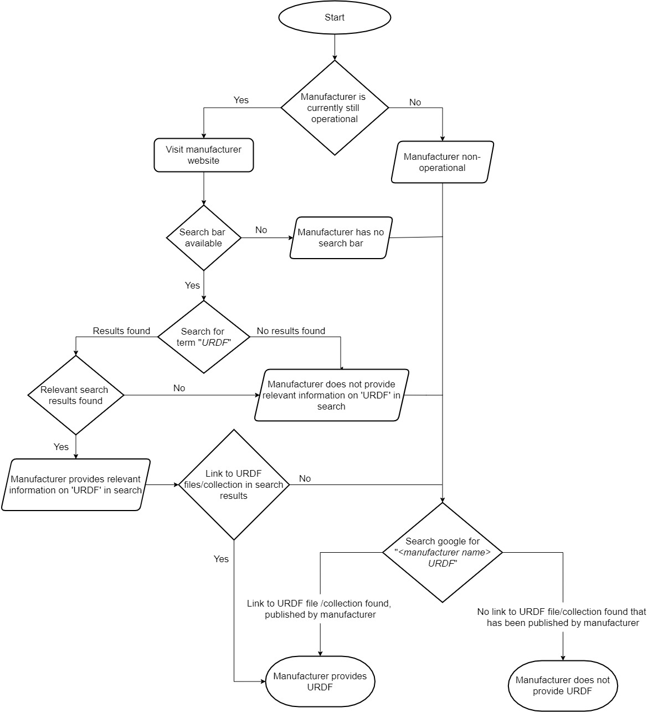

# Additional Information


## Dataset Creation

### Manually Generating URDF Files Using Xacro

To generate URDF files using xacro we used ROS noetic with Ubuntu 20.04.
For each robot we cloned the [GitHub repository](https://github.com/Kinovarobotics/kinova-ros), and followed the instructions for installing each repository as a ROS package.
For generating the new URDF files from xacro files, we ran the following command:
```
rosrun xacro xacro urdf/robot_name.xacro > new_urdfs/robot_name.urdf
```


The main steps in the process were:
* Find GitHub repository with robots described using xacro
* Clone repository into folder
* Install as ROS package
* Use xacro to generate URDF files
* Copy generated files and meshes into dataset

For most of the robots there were no issues in generating the URDF files, but we did encounter an issue when trying to export the URDF of the [_jackal_ robot](https://github.com/jackal/jackal/tree/noetic-devel/jackal_description). We needed to install 4 other packages before being able to export the URDF.
In addition, [one robot](https://github.com/PR2/pr2_common/tree/melodic-devel/pr2_description) we had found did not support ROS noetic, while another only supported [ROS2](https://github.com/UniversalRobots/Universal_Robots_ROS2_Description).

## Processing Information

This section describes the methodology used to gather the information in the dataset, where it was necessary to make assumptions or decisions on how to classify information.


### Manufacturer Categories
The steps followed when categorizing the manufacturers into industrial, research, industrial \& research, and other, is illustrated in the flow chart in the figure below.
The procedure followed to determine if a manufacturer provides URDF files/Bundles, and to collect data on whether or not the website of the manufacturer directly links to these files:




### Xacro Generated URDF Bundles

We have manually added the information on whether a URDF Bundle was manually generated by us in the each _meta-information.json_ file describing the robots.
To determine if a URDF Bundle was originally generated using xacro, we checked if the word xacro existed in each URDF file, if it did we could, with a good chance, assume that the file was generated using xacro.
As some robots in the dataset consist of multiple URDF files together in a collection, it means there are more URDF files themselves than URDF Bundles.
Thus, to determine if a URDF Bundle was originally generated using xacro, we made an assumption that the URDF files within a directory are either all originally generated using xacro or all are not.
This is a valid assumption, because if a URDF Bundle is generated using xacro all URDF files will be generated in the same manner.
There may be some cases where this assumption does not hold, for example if URDF files have manually been added to a directory.
To ensure no errors occur in the calculations, we performed the check shown in below.
If there were errors, then we manually analysed these files and added them to the results.

Check to ensure URDF Bundles are only included in results when assumption holds:
```
if n_files_containing_xacro > 0 and n_files_containing_xacro != n_urdf_files:
    print error with URDF Bundle name
    skip URDF Bundle
else:
    include URDF Bundle in results
```

Another assumption is that the majority of the URDF Bundles in the sources only contain specific robots from the same manufacturer.
This is not always the case, as some URDF Bundles may contain various robots from different manufacturers.
To mitigate this, we perform a check on the manufacturers, and if they are different within the URDF Bundle, then the results need to be analysed manually, see below.

Check to ensure URDF Bundles are only included in results when the manufacturer is the same for all robots in the URDF Bundle:
```
# should only be one unique manufacturer
if len(meta_informations['manufacturers'].unique()) > 1:
    print error with URDF Bundle and meta file name
    skip URDF Bundle
else:
    include URDF Bundle from manufacturer in results
```

### Parsing URDF Files Using the ROS Parser
To parse the URDF Bundles we used the official [ROS parser](https://github.com/ros/urdfdom).
The _urdfdom_ package version 3.1.0 was installed using [conda-forge](anaconda.org/conda-forge/urdfdom).
The parser has a Command Line Interface (CLI) where URDF files can be validated by running the command _check\_urdf_, followed by the path to the URDF file.

We can show how the CLI works by using the 2 DOF planar robot as an example.
Parsing a valid URDF file of the example robot using the ROS parser is shown below.
Changing the URDF file, and removing the name of the robot as an attribute, which is a required attribute in URDF, results in the ROS parser failing to parse the file, as shown below.

Example of running the check\_urdf command on a valid URDF of the 2 DOF example robot:
```
$ check_urdf 2dof_robot.urdf

robot name is: 2 DOF planar robot
---------- Successfully Parsed XML ---------------
root Link: base link has 1 child(ren)
    child(1):  link 1
        child(1):  link 2
```

Example of running the check\_urdf command on an invalid URDF of the 2 DOF example robot:
```
$ check_urdf 2dof_robot_invalid.urdf

Error:   No name given for the robot.
         at line 118 in D:\bld\urdfdom_1652255230747\work\urdf_parser\src\model.cpp
ERROR: Model Parsing the xml failed
```


